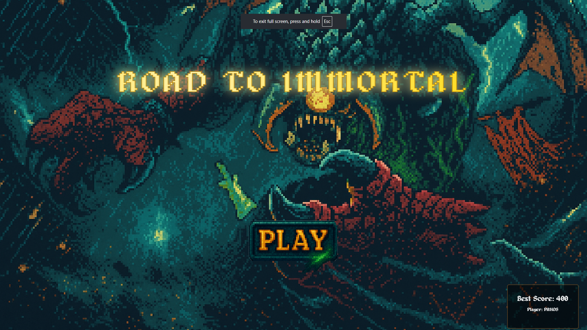
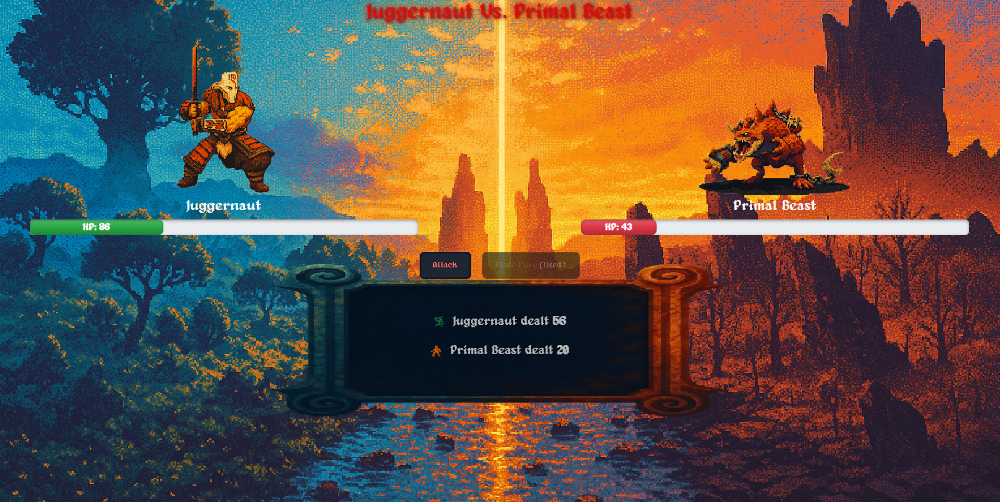
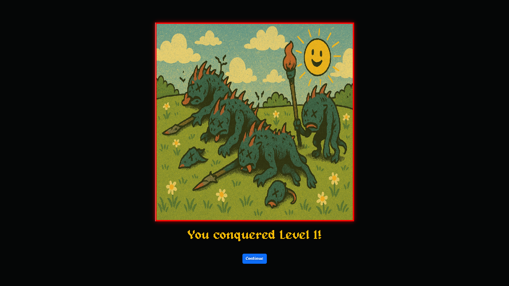

# 🛡️ Road to Immortal

**Single-player browser-based game project**  
🎮 Built with HTML, CSS, JavaScript, and Bootstrap  
🏆 Created as part of Pearson Diploma Web Programming Certification



---

## 🎮 Game Overview

**Road to Immortal** is a turn-based browser game where the player selects one of three unique heroes and battles through three progressively challenging levels to claim the **Aegis of Champions**.

---

## 🔍 Project Context

This game was developed as a web programming project for the **Pearson Diploma in IT**. It highlights front-end development skills, game logic, responsive UI design, and localStorage state management using vanilla JavaScript and Bootstrap.

> **Disclaimer:**  
> This game is an original, non-commercial educational project inspired by the universe of *Dota 2*. All names and gameplay ideas are used under fair use. No official assets or trademarks from Valve are included. This project is not affiliated with or endorsed by **Valve Corporation**.

---

## 🧩 Features

- 🧙 **Three unique heroes** with different stats and aesthetics  
- 🗺️ **Interactive map** with clickable level zones  
- ⚔️ **Three combat levels**: Creep Wave, Primal Beast, Roshan  
- 🔁 **Turn-based battle system** with normal & special attacks  
- ⚡ **Critical hit mechanics** with visual feedback  
- 📊 **Persistent high score tracking** via `localStorage`  
- 🎨 **Pixel-art style** UI and custom retro font  
- 📱 **Fully responsive layout**, optimized for all devices  

---

## 🛠️ Technologies Used

- **Frontend:** HTML5 · CSS3 · JavaScript (ES6+)  
- **Frameworks & Libraries:**  
  - [Bootstrap 5.3](https://getbootstrap.com/)  
  - [ImageMapResizer](https://github.com/davidjbradshaw/image-map-resizer) (for responsive image maps)  
- **Design:** Custom pixel-art assets, UI icons, fonts & sprites

---

## 🕹️ How to Play

1. Choose your hero: Juggernaut, Drow Ranger, or Keeper of the Light  
2. Navigate the map and clear levels in order:  
   - Creep Wave  
   - Primal Beast (mini boss)  
   - Roshan (final boss)  
3. Use normal and special attacks strategically  
4. Defeat enemies and collect the Aegis  
5. Enter your name and compete for the highest score!

---

## 🧪 How to Run

No installation required. Simply open `index.html` in a modern browser.

```bash
# Clone the repository
git clone https://github.com/PanosKar96/Road-to-Immortal---Browser-Based-Game.git

# Navigate to the folder
cd road-to-immortal

# Open index.html
open index.html


📁 File Structure

road-to-immortal/
├── index.html             # Main entry point
├── style.css              # Custom styles
├── script.js              # Game logic
├── assets/
│   ├── images/
│   │   ├── backgrounds/
│   │   ├── fonts/
│   │   ├── icons/
│   │   ├── levels/
│   │   ├── sprites/
│   │   └── cursors/
│   └── js/
│       └── imageMapResizer.min.js
└── README.md              # Project documentation

🔧 Technical Highlights
Game State Management: High scores stored using localStorage

Responsive Image Maps: Clickable level zones that adapt to screen size

Dynamic UI Rendering: Character selection and level logic via DOM

Visual Feedback: Battle log, damage flashes, critical hit animations

Modular View Management: Transitions between start, battle, game over screens

🚀 Future Improvements
Add sound effects & background music

Mobile touch gesture support

Difficulty levels (easy/normal/hard)

Save/load progress system

Additional levels and enemy types

Hero abilities with cooldowns

🎓 Educational Value
This project demonstrates:

DOM manipulation with vanilla JavaScript

Game state logic using localStorage

CSS transitions and animations

Responsive design practices

Front-end architecture using only HTML/CSS/JS

📝 License
This project is licensed under the MIT License.

Road to Immortal © 2025
Created with ❤️ for Pearson Diploma Certification
